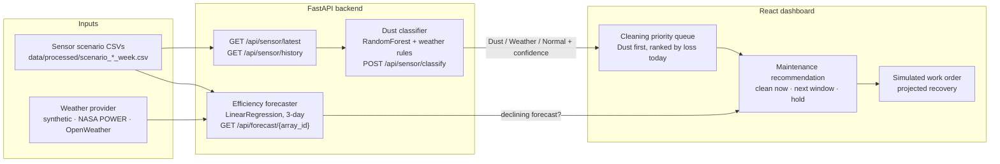

# Solare

**AI-driven cleaning intelligence for solar farms: clean panels when dust losses justify it, not by the calendar.**

[](https://github.com/aarntn/TripleT_DeepTech/actions/workflows/backend-security.yml)

> Built by team **TripleT** (Timing, Technology, Trust) for the **UM Deep Tech Hackathon**, around the Universiti Malaya patented
> *System and Method for Cleaning a Solar Panel* (**PI 2024000995**).

---

## Problem

Most solar O&M companies in Malaysia clean panels on a fixed schedule. This wastes money in two ways:

- **Cleaning too early:** crews, water, and downtime are spent on panels that are only slightly dirty, or whose output dropped because of cloud or rain.
- **Cleaning too late:** dust builds up between scheduled visits, and the panels lose energy every day until the next cleaning.

A fixed schedule can't tell a dust loss, which cleaning fixes, from a weather loss, which goes away by itself.

## Solution

Solare monitors each panel array and decides whether an efficiency drop comes from **dust** or from **weather**:

1. **Monitor.** Read per-array sensor data: efficiency, irradiance, cloud cover, humidity, rainfall, and soiling loss.
2. **Classify.** A machine-learning classifier marks each array as **Dust**, **Weather**, or **Normal** and gives a confidence score and a plain-language cause.
3. **Forecast.** A 3-day efficiency and revenue forecast shows whether output will keep falling.
4. **Recommend.** Arrays classified as Dust go to the top of a cleaning priority queue, ranked by today's loss. The dashboard recommends cleaning today if the forecast is still falling, or at the next maintenance window if it isn't. Arrays classified as Weather are held, with no dispatch.
5. **Act.** Operators simulate cleaning work orders and see the projected recovery.

In the current build, cleaning work orders are **simulated** in the dashboard. Solare does not control any cleaning hardware yet.

---

## Architecture

The system has a FastAPI backend that serves the sensor data, the ML models, and the forecasts, and a React dashboard that turns those outputs into cleaning recommendations.



### How the models work

| Model | Location | What it does |
|---|---|---|
| Dust classifier | `backend/services/dust_classifier.py` | A `RandomForestClassifier` (100 trees, with `StandardScaler`) is trained on the dusty-week and rainy-week scenario CSVs to predict `dust_flag`. When the prediction isn't dust, rules decide the label: cloud cover above 50% or any rainfall means **Weather**, and everything else is **Normal**. |
| Efficiency forecaster | `backend/services/forecaster.py` | A `LinearRegression` is fitted per array on daily efficiency against day index, cloud, humidity, rainfall, and irradiance. It predicts 3 days ahead with ±1.5σ residual bounds, using weather-provider rows when they're available. |

`MODEL_LOAD_MODE=train-fallback` (the default outside production) trains the classifier in memory at startup. `MODEL_LOAD_MODE=verified`, which is required when `APP_ENV=production`, loads saved `.joblib` files only if they match `DUST_CLASSIFIER_SHA256` and `DUST_SCALER_SHA256`.

### API endpoints

All routes except `GET /` (health check) require `Authorization: Bearer <api key>`.

| Method | Path | Purpose |
|---|---|---|
| GET | `/` | Health check |
| GET | `/api/sensor/latest` | Latest reading per array |
| GET | `/api/sensor/history` | Full sensor history per array |
| POST | `/api/sensor/classify` | Dust / Weather / Normal classification |
| GET | `/api/forecast/{array_id}` | 3-day efficiency and revenue forecast |
| GET | `/api/weather/forecast/{array_id}` | Normalised weather forecast rows |
| GET | `/api/efficiency/{location}` | Monthly efficiency profile (`malaysia` or `gcc`) |
| GET | `/api/market/locations` | Location assumptions |
| GET | `/api/market/hormuz` | Tariff-shock scenario metadata |
| POST | `/api/roi/calculate` | ROI calculator for the Revenue & ROI page |

Valid array IDs are `A1`, `A2`, `B1`, `B2`, `C1`, and `C2`. The interactive docs at `/docs` are off unless `ENABLE_API_DOCS=true`.

---

## Tech stack

| Layer | Tech |
|---|---|
| Frontend | React 18, TypeScript, Vite, Recharts, Tailwind CSS |
| Backend | Python, FastAPI, Uvicorn, Pydantic v2, Pandas, NumPy |
| ML | scikit-learn (RandomForest, LinearRegression), joblib |
| Notebooks | Jupyter |
| CI | GitHub Actions: pytest, `pip check`, `pip-audit`, gitleaks |

Versions are pinned in `backend/requirements.txt` and `frontend/package.json`.

---

## Getting started

### Prerequisites

- Python 3.11+ (CI uses 3.12)
- Node.js 18+ <!-- TODO: confirm minimum Node version; Vite 8 may need a newer Node -->

### 1. Backend (terminal A)

```bash
cd backend
python -m venv venv
source venv/bin/activate          # Windows: .\venv\Scripts\activate
pip install -r requirements.txt

cp ../.env.example ../.env        # backend reads the repo-root .env
uvicorn main:app --reload         # http://127.0.0.1:8000
```

### 2. Frontend (terminal B)

```bash
cd frontend
npm install
cp .env.example .env
npm run dev                       # http://localhost:5173
```

The example env files are already set up for local development, so the frontend and backend share the same dev API key.

### Environment variables

**Backend** (`.env` in the repo root, template `.env.example`):

| Variable | Purpose |
|---|---|
| `APP_ENV` | `development`, `test`, or `production` |
| `SOLARGUARD_API_KEYS` / `SOLARGUARD_API_KEY_SHA256S` | Accepted API keys, plain (dev) or SHA-256 hashed (production) |
| `CORS_ORIGINS`, `TRUSTED_HOSTS`, `TRUSTED_PROXY_IPS` | Network allow-lists |
| `MAX_REQUEST_BYTES` | Request body size limit |
| `RATE_LIMIT_PER_MINUTE`, `SENSITIVE_RATE_LIMIT_PER_MINUTE` | Rate limits. The sensitive limit covers `/classify` and `/roi/calculate`. |
| `ENABLE_API_DOCS`, `ENABLE_HSTS` | Swagger docs and HSTS header toggles |
| `MODEL_LOAD_MODE`, `DUST_CLASSIFIER_SHA256`, `DUST_SCALER_SHA256` | How the classifier is loaded and verified |
| `API_HOST`, `API_PORT` | Server bind address |
| `CARBON_PRICE_RM` | Carbon price used in calculations |
| `WEATHER_PROVIDER`, `WEATHER_LAT`, `WEATHER_LON`, `WEATHER_PROCESSED_PATH`, `OPENWEATHER_API_KEY` | Weather source settings (default `synthetic`) |

Keep weather API keys on the backend only.

**Frontend** (`frontend/.env`, template `frontend/.env.example`):

| Variable | Purpose |
|---|---|
| `VITE_API_BASE_URL` | Backend URL |
| `VITE_SOLARGUARD_API_KEY` | API key sent as a bearer token |
| `VITE_USE_MOCKS` | If `true`, the dashboard falls back to bundled demo data when the backend can't be reached |

The `SOLARGUARD_*` variable names come from the project's earlier name, SolarGuard.

### Running tests

The backend tests need `pytest` and `httpx`, which are not in `requirements.txt`. Install them, then run the tests from the repo root:

```bash
pip install pytest httpx
python -m pytest backend/tests
```

The frontend has a type check (`npm run typecheck`) but no test suite.

### Optional: real weather data

The synthetic datasets in the repo are the default, so demos are deterministic and work offline. To fetch real weather data:

```bash
cd data/scripts
python fetch_weather_data.py --provider nasa-power --start 20240701 --end 20240707 --array-id A1
python fetch_weather_data.py --provider openweather --array-id A1 --api-key "$OPENWEATHER_API_KEY"
```

Set `WEATHER_PROVIDER=openweather` and `OPENWEATHER_API_KEY` to fetch the forecast live from the backend.

---

## Project structure

```text
.
├── backend/                     # FastAPI service (entry point: main.py)
│   ├── api/routes/              # sensor, forecast, weather, efficiency, market, roi
│   ├── core/                    # Security middleware (auth, rate limit, headers), error handlers
│   ├── models/                  # Pydantic request/response schemas
│   ├── services/                # Dust classifier, forecaster, weather provider, ROI, degradation
│   ├── scripts/load_smoke.py    # Load smoke test
│   └── tests/                   # pytest suite
├── frontend/                    # Vite + React + TypeScript dashboard
│   ├── public/data/             # CSVs bundled for demo fallback
│   └── src/
│       ├── components/          # Priority queue, classifier card, recommendation, charts, map
│       │   └── pages/           # Overview, Farm Map, Panel Detail, Revenue & ROI
│       ├── hooks/               # useSolarGuardData: backend orchestration and fallback
│       ├── lib/api.ts           # Typed API client
│       └── utils/               # Recommendation logic, calculations
├── data/
│   ├── processed/               # Synthetic sensor scenarios, efficiency profiles, forecast input
│   └── scripts/                 # Dataset generators, weather fetcher
├── notebooks/                   # Degradation analysis (Jupyter)
├── docs/
│   ├── technical/               # Architecture notes
│   ├── commercial/              # Commercial research notes
│   └── ip/                      # Patent reference PDFs
└── .github/workflows/           # Backend security CI
```

---

## Usage / demo

The dashboard has three main views: **Operations Overview**, **Farm Map** (click an array to open **Panel Detail**), and **Revenue & ROI**.

Here is an example classification request for array A1, using the latest reading in `scenario_dusty_week.csv`:

```bash
curl -X POST http://127.0.0.1:8000/api/sensor/classify \
  -H "Authorization: Bearer $API_KEY" \
  -H "Content-Type: application/json" \
  -d '{"array_id":"A1","efficiency_pct":60.68,"irradiance_kwh_m2":1.52,
       "cloud_cover_pct":10.17,"humidity_pct":74.03,"rainfall_mm":0.0,
       "soiling_loss_pct":36.0}'
```

```json
{
  "type": "dust",
  "confidence": 1.0,
  "cause": "Sustained efficiency drop without cloud cover — dust accumulation confirmed."
}
```

On the dashboard, this result moves A1 up the cleaning priority queue and enables **Simulate work order**.

<!-- TODO: confirm and add dashboard screenshots (none are checked in yet) -->

---

## Roadmap

These items come from gaps in the current code:

- Replace the synthetic sensor scenarios with live on-site sensor feeds. The sensor endpoints currently read `data/processed/scenario_dusty_week.csv`.
- Connect recommendations to the patented cleaning hardware. Work orders are only simulated today.
- Ship pre-trained, hash-verified model files for `MODEL_LOAD_MODE=verified` deployments.
- Add a frontend test suite.

---

## Team and acknowledgements

- **Team TripleT** (Timing, Technology, Trust). <!-- TODO: confirm team member names to list -->
- Built for the **UM Deep Tech Hackathon**, Universiti Malaya.
- Based on UM patent **PI 2024000995**, *System and Method for Cleaning a Solar Panel*. The codebase also references **UI 2023002890**, *Solar-Heat-Water Harvester*, as a complementary water source for cleaning.
- Patent reference PDFs are in `docs/ip/`. For licensing enquiries, contact UMCIE at **umcie@um.edu.my**.

---

## Licence

This repository has no `LICENSE` file, so all rights are reserved by default. <!-- TODO: confirm licence with the team and UMCIE (patented IP involved) -->
